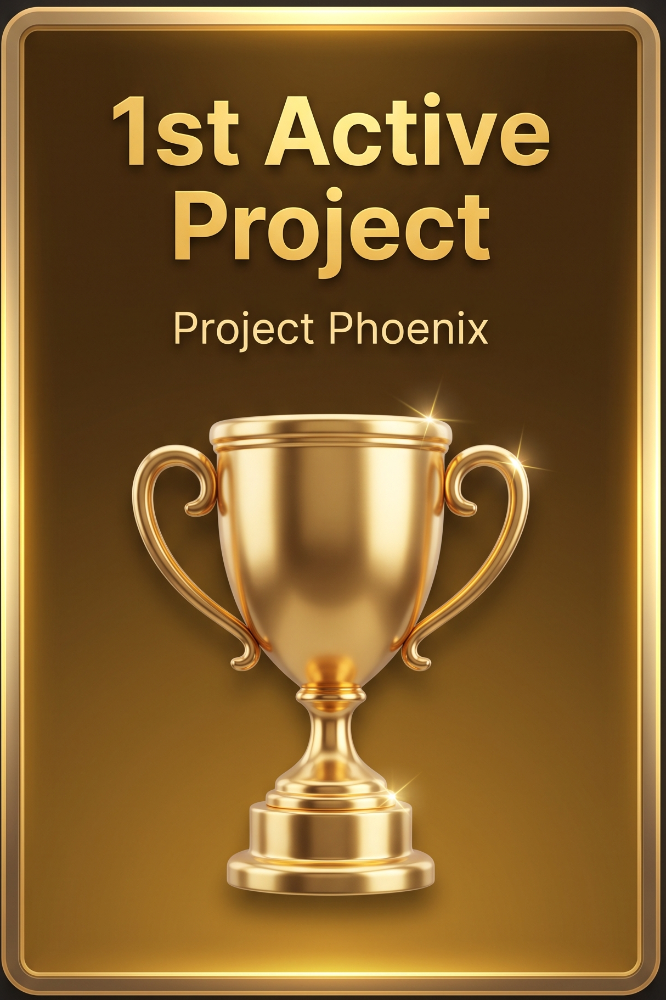
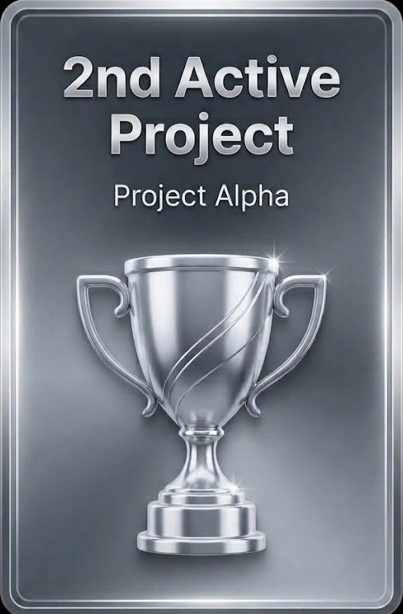
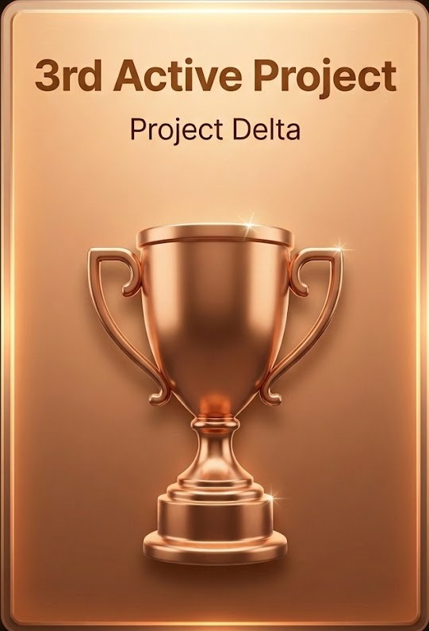
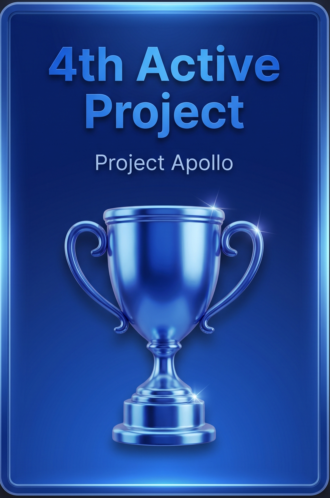
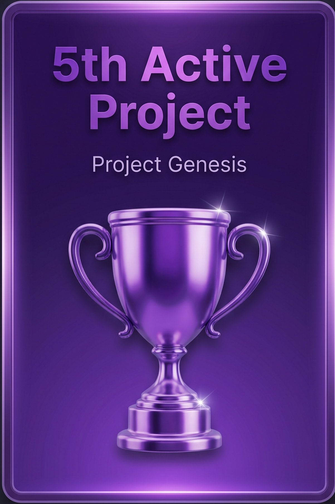

<!DOCTYPE html>
<html lang="en">
<head>
    <meta charset="UTF-8">
    <meta name="viewport" content="width=device-width, initial-scale=1.0">
    <title>Website Header</title>
    <link rel="stylesheet" href="style.css">
   
</head>

  

Hi there 👋
Myself Sivagurunathan S,

## 📊 GitHub Statistics

        

            
<h1>Discipline-OS</h1>

            
<h1>Portiflio-OS</h1>

            
<h1>Task_Alert</h1>

            
<h1>Moment-Score</h1>

            
<h1>Project 5</h1>

        

        
  

<h3 align="center">🔥 Contribution Streak</h3>

<h3 align="center">📈 Contribution Activity</h3>

- 🔭 I’m currently working on a project named as DISCIPLINE-OS
- 🌱 I’m currently learning VIBE CODING
- 👯 I’m looking for an opportunity to SHOW MY TALENT
- 🤔 I’m looking for help TO GUIDE ME IN TECH FEILD
- 💬 Ask me about THE DOUBTS IN YOUR MIND ABOUT VIBE CODING
- 📫 How to reach me: MY LINKEDIN PAGE "https://in.linkedin.com/in/sivagurunathan-s-194461388?trk=public_post_follow-view-profile"
- 😄 Pronouns: I learn by building real-world projects with AI and full-stack technologies.
- ⚡ Fun fact: I love building projects that solve real-world problems.
  
