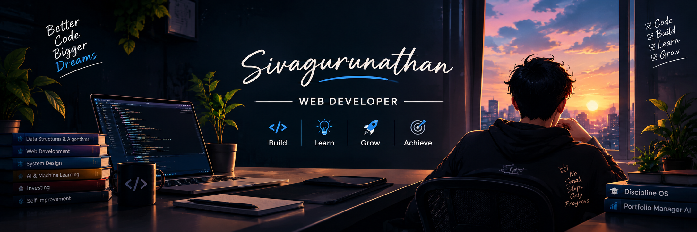
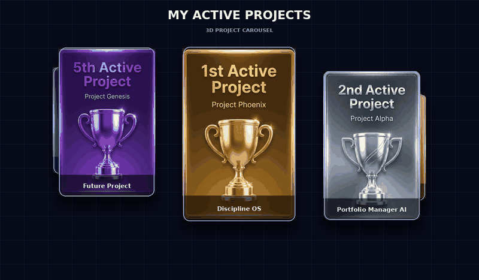

<!-- ========================================================= -->
<!--                     TOP BANNER                             -->
<!-- ========================================================= -->

  

<!-- ========================================================= -->
<!--                     INTRODUCTION                           -->
<!-- ========================================================= -->

<h1 align="center">
  Hi, I'm Sivagurunathan 👋
</h1>

  <b>Web Developer • AI Enthusiast • Builder</b>

  Code • Build • Learn • Grow

  

  

 

<!-- ========================================================= -->
<!--                     ABOUT ME                               -->
<!-- ========================================================= -->

<h2 align="center">👨‍💻 About Me</h2>

  I'm a passionate developer who enjoys building practical software,
  exploring AI-powered solutions and continuously improving my skills.

  🚀 Building Projects &nbsp; • &nbsp;
  🤖 Exploring AI &nbsp; • &nbsp;
  💻 Learning Development

 

<!-- ========================================================= -->
<!--                  3D PROJECT SHOWCASE                       -->
<!-- ========================================================= -->

<h2 align="center">🚀 My Projects</h2>

  <b>Explore my projects in a 3D rotating showcase</b>

 

  

 

<!-- ========================================================= -->
<!--                     PROJECT LIST                           -->
<!-- ========================================================= -->

<h3 align="center">🔥 Featured Projects</h3>

<table align="center">
<tr>

<td align="center" width="250">

### 🧠 Discipline OS

AI-powered study scheduling and academic productivity system.

</td>

<td align="center" width="250">

### 📊 Portfolio Manager AI

Personal investment portfolio analysis and management system.

</td>

<td align="center" width="250">

### 🔔 Task Alert

Task management and notification-based productivity project.

</td>

</tr>

<tr>

<td align="center" width="250">

### ⏱️ Moment Score

Productivity and performance tracking project.

</td>

<td align="center" width="250">

### 🚀 Project 5

More projects coming soon.

</td>

<td align="center" width="250">

### 💡 Future Projects

Always building something new.

</td>

</tr>

</table>

 

<!-- ========================================================= -->
<!--                  GITHUB STATISTICS                         -->
<!-- ========================================================= -->

<h2 align="center">📊 GitHub Statistics</h2>

  <b>My coding activity and GitHub journey</b>

 

&nbsp;&nbsp;

 

<!-- ========================================================= -->
<!--                    CONTRIBUTION STREAK                     -->
<!-- ========================================================= -->

<h2 align="center">🔥 Contribution Streak</h2>

  <b>Consistency is the key to improvement.</b>

 

 

<!-- ========================================================= -->
<!--                  CONTRIBUTION ACTIVITY                     -->
<!-- ========================================================= -->

<h2 align="center">📈 Contribution Activity</h2>

 

<!-- ========================================================= -->
<!--                       TECH STACK                           -->
<!-- ========================================================= -->

<h2 align="center">🛠️ Languages • Frameworks • Tools</h2>

 

 

<!-- ========================================================= -->
<!--                    CURRENT FOCUS                           -->
<!-- ========================================================= -->

<h2 align="center">🎯 Currently Building</h2>

<table align="center">

<tr>

<td align="center" width="300">

### 🧠 Discipline OS

AI-powered study scheduling,
notes allocation and academic
productivity platform.

</td>

<td align="center" width="300">

### 📊 Portfolio Manager AI

Personal portfolio tracking,
investment analysis, P&L,
charges and performance.

</td>

</tr>

</table>

 

<!-- ========================================================= -->
<!--                       GOALS                                -->
<!-- ========================================================= -->

<h2 align="center">🌱 My Development Journey</h2>

💻 Improve Development Skills  
 
🤖 Build Useful AI Applications  
 
🚀 Create Real-World Projects  
 
📚 Learn Something New Every Day  
 
🌎 Build Products That Solve Problems

 

<!-- ========================================================= -->
<!--                       CONNECT                              -->
<!-- ========================================================= -->

<h2 align="center">🌐 Connect With Me</h2>

 

<!-- ========================================================= -->
<!--                       FOOTER                               -->
<!-- ========================================================= -->

<b>⚡ Code. Build. Learn. Grow. ⚡</b>

  

<i>Thanks for visiting my profile!</i>

- 🔭 I’m currently working on a project named as DISCIPLINE-OS
- 🌱 I’m currently learning VIBE CODING
- 👯 I’m looking for an opportunity to SHOW MY TALENT
- 🤔 I’m looking for help TO GUIDE ME IN TECH FEILD
- 💬 Ask me about THE DOUBTS IN YOUR MIND ABOUT VIBE CODING
- 📫 How to reach me: MY LINKEDIN PAGE "https://in.linkedin.com/in/sivagurunathan-s-194461388?trk=public_post_follow-view-profile"
- 😄 Pronouns: I learn by building real-world projects with AI and full-stack technologies.
- ⚡ Fun fact: I love building projects that solve real-world problems.
  
